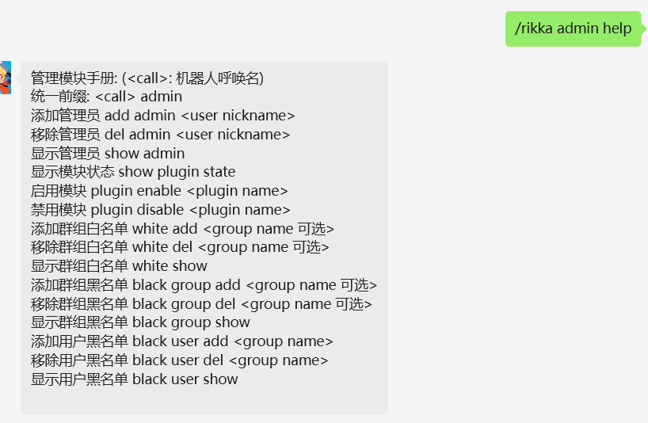

# 管理权限模块 

> [!TIP]
> 插件代码位置: [/rikkabot/plugins/admin/adminplugin.go](https://github.com/Clov614/rikka-bot-wechat/tree/main/rikkabot/plugins/admin/adminplugin.go)


## 功能说明

仅`超级管理员` (机器人账号自己) 能操作`管理权限赋权`

管理员可以控制 `群组/用户` 白黑名单

管理员可以控制 插件的`启用/禁用`

## 立即使用

```bash
<call name> admin help
```

> [!TIP]
> <call name> 为呼唤机器人的前缀，群聊中可通过@botname 或者 /rikka 

## 图解



