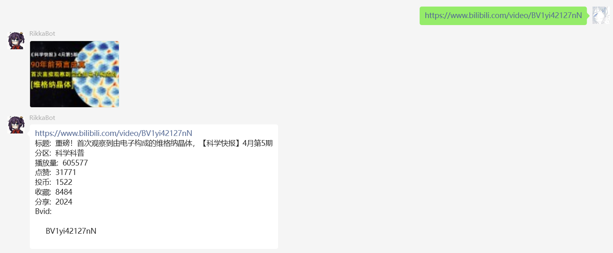
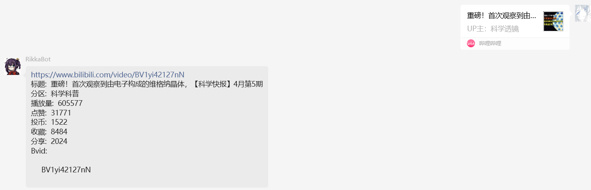
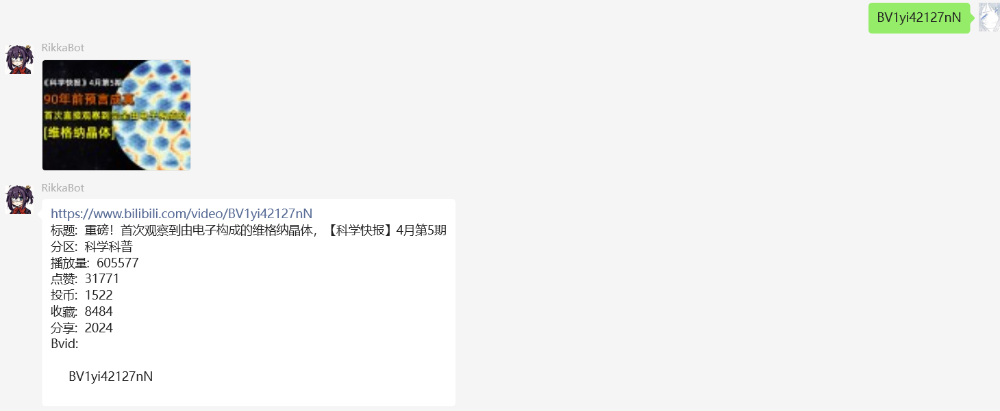

# bilibili链接解析模块 

> [!TIP]
> 插件代码位置: [/rikkabot/plugins/admin/adminplugin.go](https://github.com/Clov614/rikka-bot-wechat/tree/main/rikkabot/plugins/biliUrlDecode/biliUrlDecode.go)

## 功能说明

以下三种消息可以触发链接解析:

- bvid: BV1yi42127nN

- 原始链接/分享短链: https://www.bilibili.com/video/BV1yi42127nN

- 分享的app消息

## 立即使用

被动技能无需主动命令发起

## 图解

